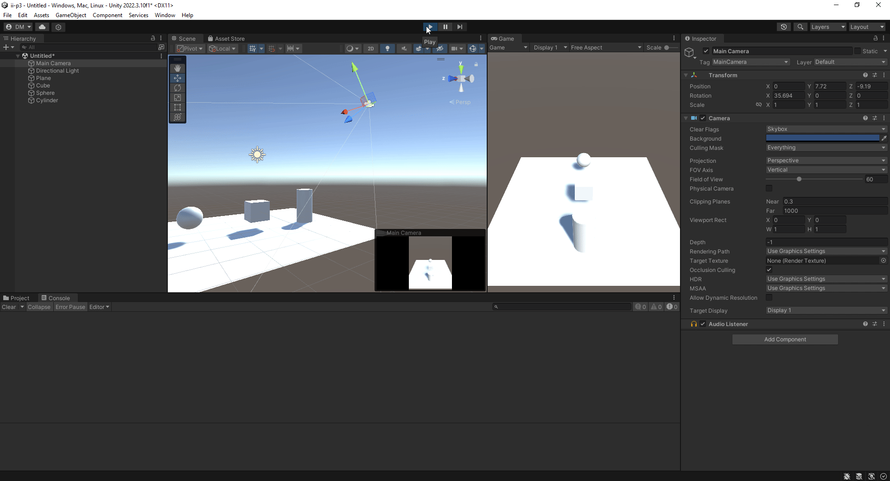
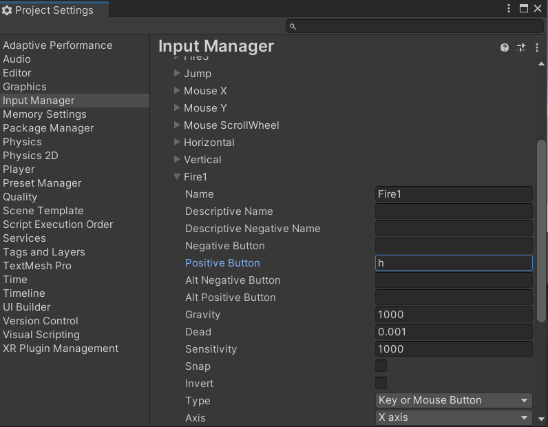
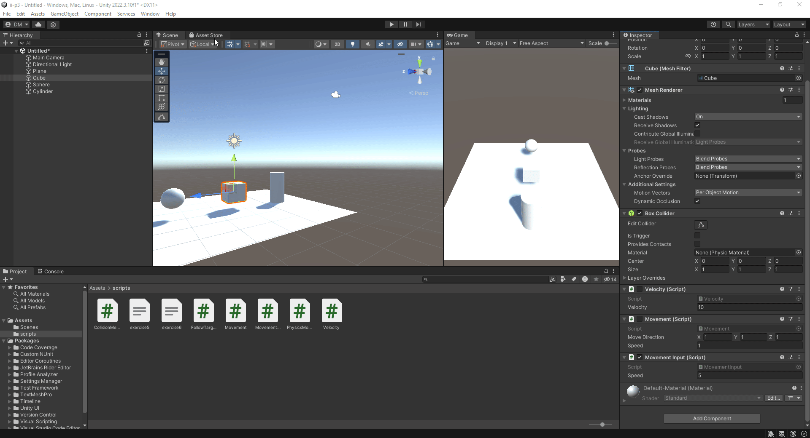
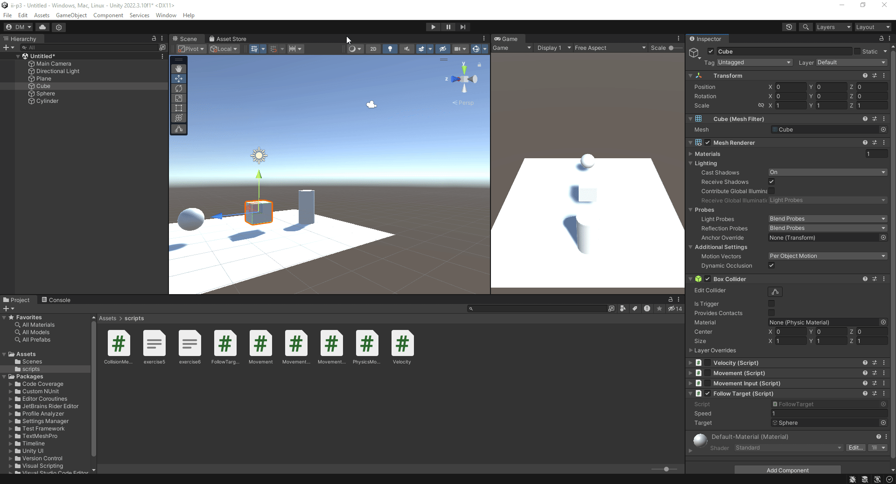
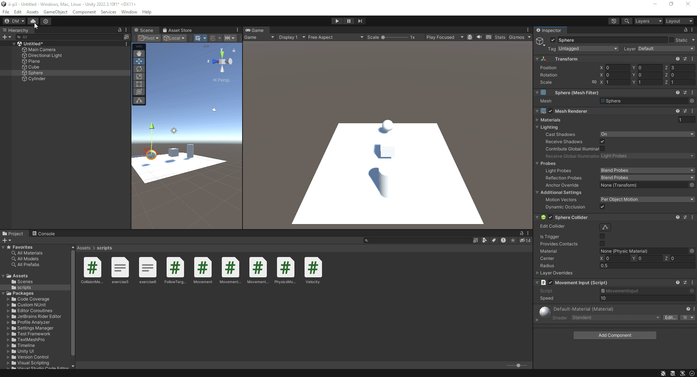
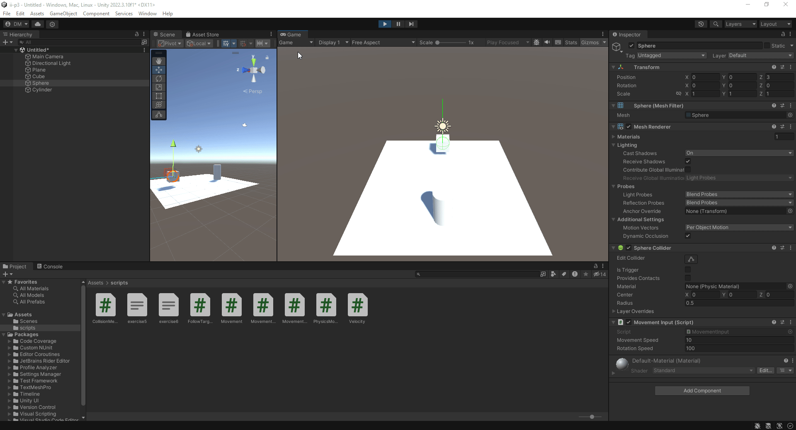
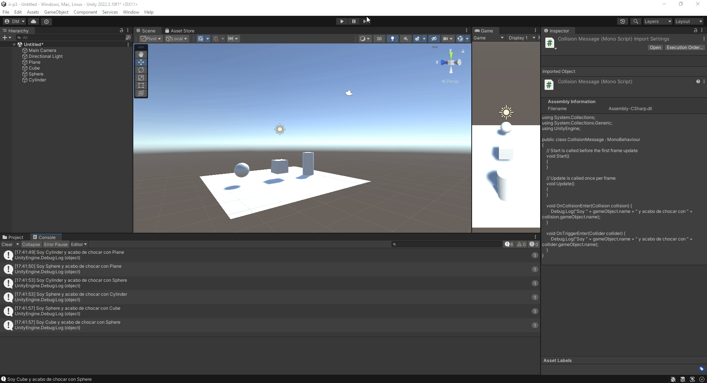
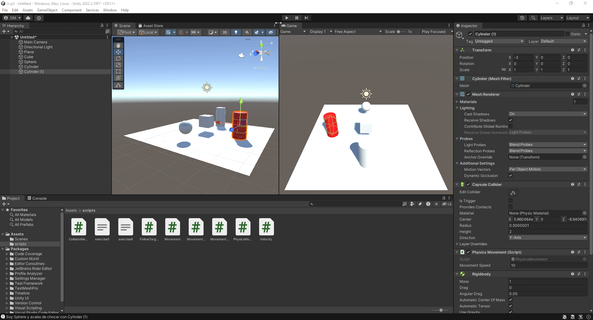

# Interfaces Inteligentes
## Práctica 3
### Diego Herrera Mendoza
Introducción a C#

En esta práctica se ha pedido realizar varios ejercicios de scripting en Unity con C#. Cada ejercicio será escrito con su mostrado con su enunciado y un gif de su correcto funcionamiento.

1. Agrega un campo velocidad al cubo de la práctica anterior y asígnale un valor que se pueda cambiar en el inspector de objetos. Muestra la consola el resultado de multiplicar la velocidad por el valor del eje vertical y por el valor del eje horizontal cada vez que se pulsan las teclas flecha arriba-abajo ó flecha izquierda-derecha. El mensaje debe comenzar por el nombre de la flecha pulsada. 

Script: [Velocity.cs](scripts/Velocity.cs)

---

2. Mapea la tecla H a la función disparo. 

---

3. Crea un script asociado al cubo que en cada iteración traslade al cubo una cantidad proporcional un vector que indica la dirección del movimiento: moveDirection que debe poder modificarse en el inspector. La velocidad a la que se produce el movimiento también se especifica en el inspector, con la propiedad speed. Inicialmente la velocidad debe ser mayor que 1 y el cubo estar en una posición y=0. En el informe de la práctica comenta los resultados que obtienes en cada una de las siguientes situaciones:

- Duplicas las coordenadas de la dirección del movimiento.

    - Respuesta: El cubo viaja al doble de velocidad independientemente de la velocidad.

- Duplicas la velocidad manteniendo la dirección del movimiento.

    - Respuesta: El cubo viaja al doble de velocidad independientemente de las coordenadas de la dirección.

- La velocidad que usas es menor que 1

    - Respuesta: El cubo viaja más lentamente.

- La posición del cubo tiene y > 0

    - Respuesta: No pasa nada fuera de lo común.

- Intercambiar movimiento relativo al sistema de referencia local y el mundial.

    - Respuesta: No pasa nada fuera de lo común.

Script: [Movement.cs](scripts/Movement.cs)

---

4. Mueve el cubo con las teclas de flecha arriba-abajo, izquierda-derecha a la velocidad speed. Cada uno de estos ejes implican desplazamientos en el eje vertical y horizontal respectivamente. Mueve la esfera con las teclas w-s (movimiento vertical) a-d (movimiento horizontal).

Script: [MovementInputOld.cs](scripts/MovementInputOld.cs)

---

5. Adapta el movimiento en el ejercicio 4 para que sea proporcional al tiempo transcurrido durante la generación del frame.

Script: [MovementInputOld.cs](scripts/MovementInputOld.cs)

---

6. Adapta el movimiento en el ejercicio 5 para que el cubo se mueva hacia la posición de la esfera. Debes considerar, que el avance no debe estar influenciado por cuánto de lejos o cerca estén los dos objetos. 

Script: [FollowTarget.cs](scripts/FollowTarget.cs)

---

7. Adapta el movimiento en el ejercicio 6 de forma que el cubo gire hacia la esfera. Realiza pruebas cambiando la posición de la esfera mediante las teclas awsd

Script: [FollowTarget.cs](scripts/FollowTarget.cs)

---

8. Utilizar el eje “Horizontal” para girar el objetivo y que avance siempre en la dirección hacia adelante.

 

Script: [MovementInput.cs](scripts/MovementInput.cs)

---

9. Configura el cilindro como un objeto físico, cuando el cubo o la esfera colisionen con él se debe mostrar un mensaje en consola con la etiqueta del objeto que haya colisionado. 

 

Script: [CollisionMessage.cs](scripts/CollisionMessage.cs)

---

10. Configura el cubo como un objeto cinemático y la esfera como un objeto físico. Adapta los scripts del ejercicio 9 para obtener el mismo comportamiento.

**Gif en el apartado 9**

Script: [CollisionMessage.cs](scripts/CollisionMessage.cs)

---

11. Configura el cilindro como un objeto de tipo Trigger. Adapta los scripts de los ejercicios anteriores para obtener el mismo comportamiento.

**Gif en el apartado 9** 

Script: [CollisionMessage.cs](scripts/CollisionMessage.cs)

---

12. 

 

Script: [PyshicsMovement.cs](scripts/PyshicsMovement.cs)

- Esfera con masa 10 veces más que el cilindro &rarr; Las físicas funcionan correctamente y al cilindro le cuesta mover más la esfera.
- Esfera con masa 10 veces menos que el cilindro &rarr; Las físicas funcionan correctamente y el impacto hace que la esfera salga volando.
- Esfera cinemática &rarr; El cilindro atraviesa a la esfera.
- Esfera trigger &rarr; No cambia nada.

- Cilindro con fricción duplicada &rarr; Al cilindro le cuesta más deslizarse

--- 

